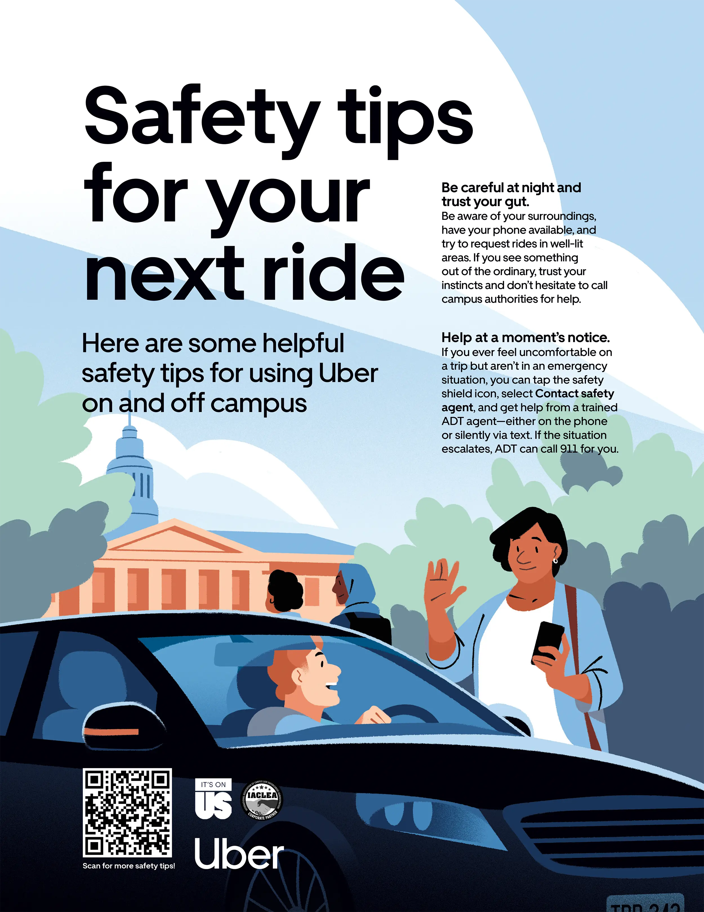
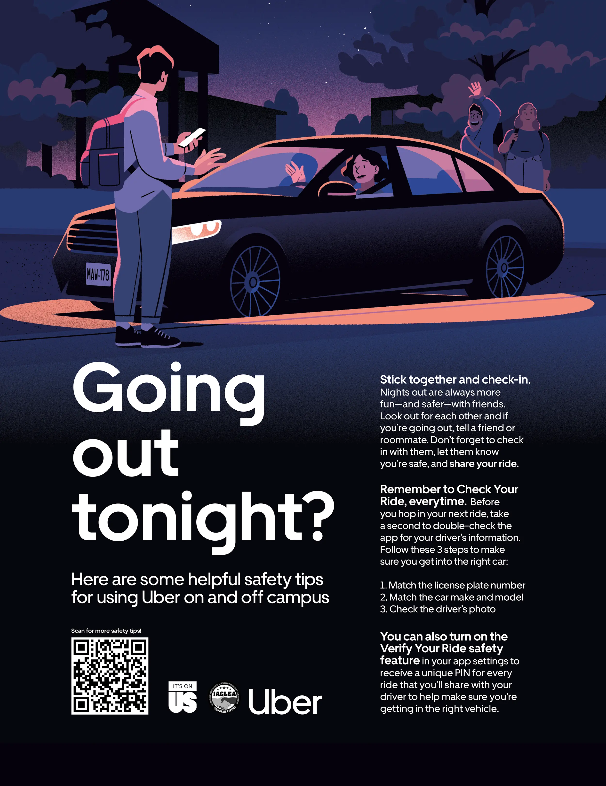

  <mux-player
    playback-id={frontmatter.thumbnail.playbackId}
    stream-type="on-demand"
    min-resolution="1080p"
    autoplay
    loop
    muted
    style="aspect-ratio: 1/1"
  />

  <mux-player
    playback-id={"EsfhNJHjTQAstpTpI00olRVLcImUSFwo00qCRWDZaBjMY"}
    stream-type="on-demand"
    min-resolution="1080p"
    autoplay
    loop
    muted
    style="aspect-ratio: 1/1"
  />

  <mux-player
    playback-id={"H43cPYPEUBxALJT3HdCMG1i7aXzaqEPTs02W76taSUHQ"}
    stream-type="on-demand"
    min-resolution="1080p"
    autoplay
    loop
    muted
    style="aspect-ratio: 1/1"
  />

  

  

